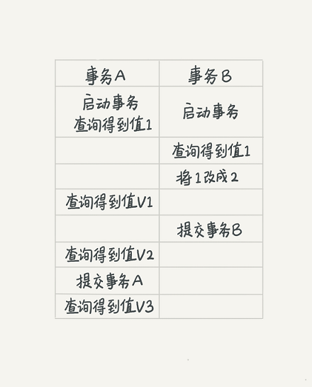

# 03 | 事务隔离
### 1、事务的基本要素 ACID 

- 原子性 Atomicity
- 一致性 Consistency
- 隔离性 Isolation
- 持久性 Durability

### 2、事务的隔离级别

- 读未提交 read-uncommitted: 一个事务未提交时，他做的变更能被其它事务看到。
    
- 读提交 read-committed ： 一个事务提交后，它做的变更才能被其它事务看到
- 可重复读 repeatable-read：一个事务在执行过程中看到的数据和在事务启动前看到的数据一致，未提交的变更其它事务是不可见的。
- 串行化  serializable：对于同一行记录，写->写锁 ，读->读锁。当出现读写锁冲突时，只有当前一个事务执行完，下个一才能开始。

 > read-uncommitted: v1 = v2 = v3=2  
 > read-committed : v1=1,v2=v3=2  
 > repeatable-read : v1=v2=1 v3=2  
 > serialize:A事务开始，事务B不能执行，只有A事务执行完成，事务B才可以进行，v1=v2=1 v3=2 
 
 
### 3、事务的并发问题

- 脏读：事务A读取了事务B更新的数据，然后B回滚操作，那么A读取到的数据是脏数据 
-  不可重复读：事务 A 多次读取同一数据，事务 B 在事务A多次读取的过程中，对数据作了更新并提交，导致事务A多次读取同一数据时，结果不一致。
- 幻读：系统管理员A将数据库中所有学生的成绩从具体分数改为ABCDE等级，但是系统管理员B就在这个时候插入了一条具体分数的记录，当系统管理员A改结束后发现还有一条记录没有改过来，就好像发生了幻觉一样，这就叫幻读。
- 不可重复读的和幻读很容易混淆，不可重复读侧重于修改，幻读侧重于新增或删除。解决不可重复读的问题只需锁住满足条件的行，解决幻读需要锁表

| 事务隔离级别 | 脏读   |不可重复读 | 幻读|
| :------| ------: | :------: | :----- |
| 读未提交 | Y | Y | Y |
| 读提交 | N | Y | Y|
|可重复读|N|N|Y|
|串行化|N|N|N|

### 4、事务隔离的实现
> 在MySQL中，实际上每条记录在更新的时候都会同时记录一条回滚操作，记录上最新的值，通过回滚操作，都可以得到前一个状态的值，
回滚日志在系统判断没有事务需要用到这些回滚日志的时候，日志会被删除，统里没有比这个回滚日志更早的 read-view 的时候就是不需要。

### 5、事务的启动
- 显示启动事务：begin / start transaction ,提交 commit  回滚 rollback
- set autocommit=0 ,这个命令会将这个线程的自动提交关闭，意味着如果你只执行一个 select 语句，这个事务就启动了，而且并不会自动提交。这个事务持续存在直到你主动执行commit 或 rollback 语句，或者断开连接
    
### 6、如何避免长事务对业务的影响？
##### 6.1 从应用开发端来看：
- 配置set autocommit=1；
- 确认是否存在不必要的只读事务
- 业务连接数据库的时候，根据业务本身的预估，通过 SET MAX_EXECUTION_TIME 命令，来控制每个语句执行的最长时间，，避免单个语句意外执行太长时间

##### 6.2  ，从数据库端来看

- 监控 information_schema.Innodb_t表，设置长事务阈值，超过就报警 / 或者 kill；
- Percona 的 pt-kill 这个工具不错，推荐使用；
- 在业务功能测试阶段要求输出所有的 general_log，分析日志行为提前发现问题；
- 如果使用的是 MySQL 5.6 或者更新版本，把 innodb_undo_tablespaces 设置成 2（或更大的值）。如果真的出现大事务导致回滚段过大，样设置后清理起来更方便。

