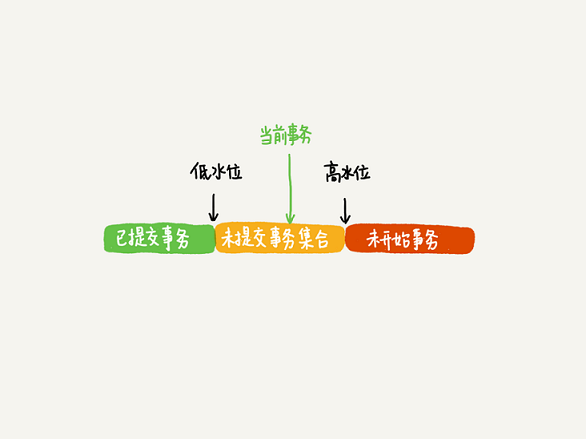

# 08 | 事务到底是否需要隔离
### 1、事务的起点 
> begin / start transaction 命令并不是事务的起点，在执行到它们之后的第一个操作InnoDB 表的语句，事务才真正启动。如果你要马上启动一个事务，可以使用`start transaction with consistent snapshot` 这个命令。  
 
> 第一种启动方式 ：一致性视图 是在执行第一个快照读语句时创建的。  
> 第二种启动方式：一致性视图 是在执行 start transaction with consistent snapshot 语句时创建的。

### 2、视图的概念
> 1、一个是view, 它是查询语句第一的虚拟表，在调用的时候执行查询语句并生成结果。创建视图的语法 create view .. ,查询方法与表一样。  
> 2、InnoDB在是实现MVCC(数据库的多版本并发控制)时用到的一致性视图，即consistent read view ，用于支持RC（Read Committed 读提交）和RR (Repeatable Read，可重复读)隔离级别的实现。 

### 3、`快照`在MVCC里是如何工作的？

> 1、InnoDB 中每个事务有唯一的事务ID,---> `transcation_id`,它是在事务开始的时候向InnoDB 的事务系统申请的，是按照申请顺序严格递增的。
> 2、每行数据有多个版本，每次事务更新数据的时候，都会生成一个新的数据版本，并且把transcation_id 赋值给数据版本的事务Id , --->`row trx_id`.同时在旧的数据版本需要保留，并且在新的版本数据中能够有数据能够直接拿到它。

> 3、InnoDB 为每个事务构建一个数组，用来保证事务启动的瞬间，当前正在活跃的  所有事务id,活跃是指启动了但为提交。  
> 事务里面事务ID 的最小值记为低水位，当前系统里面已经创建过的事务 ID 的最大值加 1 记为高水位。  
 这个视图数组和高水位就组成了当前事务的一致性视图（read-view）
 
 
 - 对于当前事务的启动瞬间来说，一个数据版本的row_trx_id,有以下几种情况：
 > 1、如果落在绿色部分，表示这个版本是已提交的事务或者是当前事务自己生成的，这个数据是可见的；  
> 2、如果落在红色部分，表示这个版本是由将来启动的事务生成的，是不可见的  
> 3、如果落在黄色部分，那就包括两种情况   
>> a. 若 row trx_id 在数组中，表示这个版本是由还没提交的事务生成的，不可见；  
    b. 若 row trx_id 不在数组中，表示这个版本是已经提交了的事务生成的，可见。  
   
**`nnoDB 利用了“所有数据都有多个版本”的这个特性，实现了“秒级创建快照”的能力。`**

### 4、更新逻辑
- `当前读` 更新数据是先读后写的，而这个读只能读当前的值，称为当前读（current read）

>可重复读的核心就是一致性读（consistent read）；而事务更新数据的时候，只能用当前读。如果当前的记录的行锁被其他事务占用的话，就需要进入锁等待。

- 而读提交的逻辑和可重复读的逻辑类似，它们最主要的区别是：
> 1、在可重复读隔离级别下，只需要在事务开始的时候创建一致性视图，之后事务里的其他查询都共用这个一致性视图；
> 2、在读提交隔离级别下，每一个语句执行前都会重新算出一个新的视图

 
